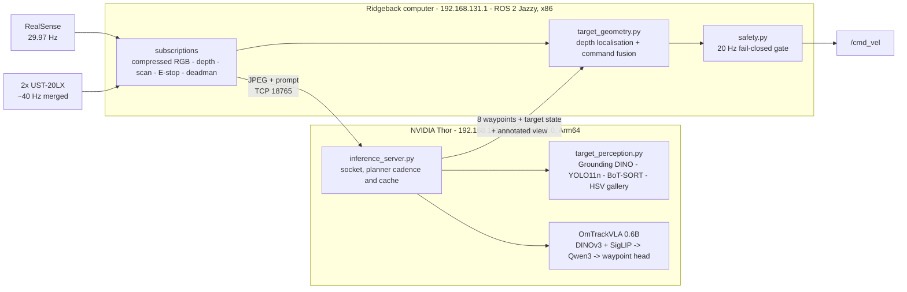
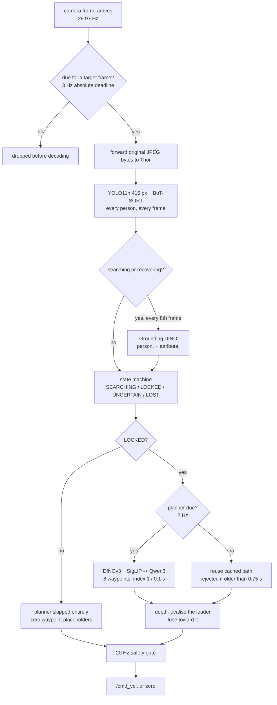
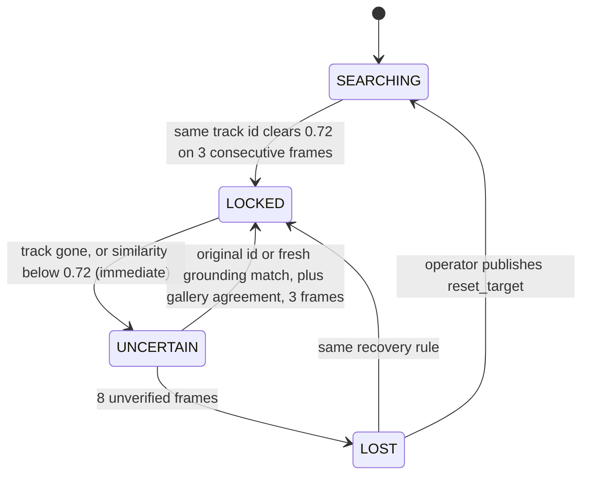
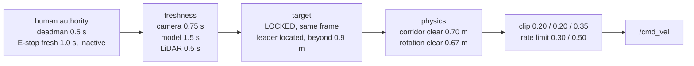

# Clearpath Ridgeback deployment

This bridge keeps ROS 2 Jazzy (Python 3.12) separate from OmTrackVLA's Python 3.9
environment. `inference_server.py` performs OmTrackVLA waypoint inference and target
perception (`target_perception.py`) on loopback TCP by default, or on the dedicated
robot network with one explicitly allowed Ridgeback IP. `ridgeback_ros2_node.py` owns
ROS subscriptions and the safety-gated velocity output.

## System architecture

### Where the modules run

Two machines, two Python runtimes, one socket between them. Inference moved to Thor;
everything that can stop the robot stayed on the Ridgeback computer.



The socket carries length-prefixed JSON. The Thor server binds only to its
robot-network address and accepts exactly one client IP; it is neither authenticated
nor encrypted, so port `18765` must stay on the dedicated robot network.

### One frame's journey



Three independent clocks: detection at 3 Hz, the planner at 2 Hz, and the safety gate
at 20 Hz. The gate **samples** the model rather than being called by it, so a hung or
disconnected planner cannot hold the robot in motion.

### Module map

| Module | Runs on | Role | Can stop the robot |
| --- | --- | --- | --- |
| `ridgeback_ros2_node.py` | Ridgeback | ROS subscriptions, rate gate, fusion call, publications | yes |
| `safety.py` | Ridgeback | the twelve ordered motion conditions, clipping, rate limiting | yes, this is the gate |
| `target_geometry.py` | Ridgeback | depth to `base_link`, coverage/consistency checks, `fuse_target_command` | yes, by refusing a position |
| `inference_server.py` | Thor | frame gating, planner cache and provenance, socket | no, it only proposes |
| `target_perception.py` | Thor | grounding, tracking, appearance gallery, state machine | no, but `LOCKED` is required |
| `protocol.py` | both | length-prefixed JSON framing | no |
| `perf_log.py` | both | timing instrumentation | no |
| `gpu_ops.py` | neither | CUDA colour maths, measured slower than OpenCV, **not wired in** | no |

Offline tooling that does not run during live inference: `evaluate_offline.py`,
`export_bag_frames.py`, `calibrate_camera_mount.py`, `bench_*.py`, and
`summarize_perf.py`. The supervised launcher runs `hokuyo_scip_reset.py` during
scanner startup on the Ridgeback computer.

### Target state machine

Only `LOCKED` permits motion. A lost identity is never reassigned to a different
person automatically.



### The motion gate

Evaluated in this order, every 50 ms. Any failure publishes zero and names its own
reason on the status topic.



Dry-run sits above all of it and forces zero. The supervised launcher normally sets
the armable flag after an operator types `ENABLE`; direct launcher opt-in is also
possible. Remote inference additionally requires `OMTRACKVLA_ALLOW_REMOTE_ARM=1`.

## Thor inference split

This project's Thor is `nvidia-thor-r100-0160.local` at `192.168.131.51` on the
Ridgeback's `192.168.131.0/24` robot network. The Ridgeback computer uses
`192.168.131.1` as its source address to reach it (`ip route get 192.168.131.51`).
SSH confirmed Arm64 and JetPack 7.0, and the Thor Python environment confirmed a CUDA
tensor operation on NVIDIA Thor. A real model load and a no-person live dry-run also
passed; locked-target planner behavior is still awaiting a matched replay.

Only inference moves: Thor runs `inference_server.py`, target perception, model code,
and the `models/` weights. The Ridgeback computer continues to run ROS 2 Jazzy,
camera/depth, LiDAR, E-stop/deadman, target/depth fusion, the 20 Hz safety gate, and
`/cmd_vel`. The existing Arm64 environment on Thor is at
`/home/robot/dev/omtrackvla/.conda-env`; do not copy the x86 `.conda-env` from this
computer. Model weights were copied to `/home/robot/dev/omtrackvla/models/` separately
from Git.

To rebuild this project's Thor environment after an OS change, use Python 3.12 in a
new virtual environment and install `real_robot/requirements_thor.txt`. This Thor
lacks the Ubuntu `python3-venv`/`ensurepip` package, so the existing environment was
created with `python3 -m venv --without-pip` and bootstrapped with the official
`https://bootstrap.pypa.io/get-pip.py`. Verify `torch.cuda.is_available()` and a CUDA
tensor operation before running the server. The pinned requirements are scoped to
this project and its current JetPack 7.0; they are not an instruction to change any
other Thor environment.

Start inference on Thor in one terminal:

```bash
ssh robot@192.168.131.51
cd /home/robot/dev/omtrackvla
./real_robot/start_inference_thor.sh
```

On the Ridgeback computer, start the ROS bridge in **dry-run** in another terminal:

```bash
cd /home/robot/Desktop/omtrackvla
ROBOT_NAMESPACE=r100_0160 \
CAMERA_TOPIC=camera/color/image_raw/compressed \
CAMERA_COMPRESSED=true \
./real_robot/start_ridgeback_thor.sh
```

`start_ridgeback_thor.sh` sets `OMTRACKVLA_INFERENCE_HOST=192.168.131.51` and
delegates to the existing dry-run launcher. The normal `start_ridgeback.sh` still
defaults to local inference. The Thor server binds only to its robot-network address
and accepts only `192.168.131.1`; these addresses can be overridden with
`OMTRACKVLA_THOR_BIND_IP`, `OMTRACKVLA_RIDGEBACK_IP`, and
`OMTRACKVLA_INFERENCE_HOST` if this project's network changes. This project's JSON
socket is not authenticated or encrypted; keep port `18765` on the dedicated robot
network. The bridge rejects a response if its camera frame has become stale and the
existing safety gate stops output when inference is disconnected or stale.

The first dry-run received 117 no-person frames at 3.007 Hz with a 50.932 ms maximum
control interval. With the deadman published during a second dry-run, stopping the
Thor server produced `dry_run:inference_disconnected` while the 20 Hz host control
timer continued. Verify target lock, the 2 Hz planner, LiDAR freshness, reconnect
behavior, and matched replay before any armable trial. Keep the
supervised armable launch on the current host until the Thor path passes the replay,
timing, and physical safety gates in `docs/COMPUTE_PLACEMENT_PLAN.md`. The remote
launcher rejects `OMTRACKVLA_ARM_OUTPUT=1` unless the operator also sets
`OMTRACKVLA_ALLOW_REMOTE_ARM=1` after those gates pass.

## Safety behavior

The controller starts in dry-run and publishes no velocity. Armed motion requires all
of the following at the same time:

- a continuously refreshed `omtrackvla/enable` Boolean deadman message;
- a fresh, inactive `platform/emergency_stop` state;
- fresh RGB camera, LiDAR scan, and model result;
- no valid LiDAR return inside the configured stop distance in the proposed
  translation corridor; close returns still block motion toward them and rotation;
- a `LOCKED` target from the target manager for the same frame as the path;
- a valid depth location for the locked target; target fusion corrects an opposite
  OmTrackVLA proposal toward that leader;
- target distance above `0.9 m` for translation; inside that distance translation stops;
- finite model output, clipped to the configured speed limits.

Loss of any required input commands zero velocity briefly and then stops publishing.
Keep the physical E-stop in hand and test dry-run before allowing motor output.

## Start in dry-run

This machine's Clearpath configuration identifies the robot as `r100_0160`, with its
RealSense compressed color stream at `camera/color/image_raw/compressed` and merged
dual-LiDAR scan at `sensors/scan`. The compressed transport is required here: adding a
second subscriber to the uncompressed RGB stream reproducibly stops both Hokuyo scan
streams on this computer. You can verify the selected topics without publishing:

```bash
source /opt/ros/jazzy/setup.bash
ros2 topic list
ros2 topic info /r100_0160/camera/color/image_raw/compressed
ros2 topic info /r100_0160/sensors/scan
ros2 topic info /r100_0160/platform/emergency_stop
```

Start the bridge against those topics:

```bash
cd /home/robot/Desktop/omtrackvla
ROBOT_NAMESPACE=r100_0160 \
CAMERA_TOPIC=camera/color/image_raw/compressed \
CAMERA_COMPRESSED=true \
./real_robot/start_ridgeback.sh
```

This loads the real model but remains motion-silent in dry-run. Dummy inference is
still available for protocol-only checks by adding `OMTRACKVLA_DUMMY_INFERENCE=1`.
Inspect status with:

```bash
ros2 topic echo /r100_0160/omtrackvla/status
```

## Observe OmTrackVLA predictions

The bridge publishes OmTrackVLA's outputs even in dry-run. These are observation-only
topics and are never connected directly to Ridgeback's `cmd_vel` input:

```bash
# Target-fused velocity proposed to the safety gate (not sent in dry-run)
ros2 topic echo /r100_0160/omtrackvla/proposed_cmd_vel

# Raw speed-limited OmTrackVLA waypoint command before target fusion
ros2 topic echo /r100_0160/omtrackvla/raw_cmd_vel

# All predicted local waypoints in the robot's base_link frame
ros2 topic echo /r100_0160/omtrackvla/predicted_path

# Direct target-follow goal used by the fusion layer
ros2 topic echo /r100_0160/omtrackvla/fused_path
```

Add `/r100_0160/omtrackvla/predicted_path` as a Path visualization in Foxglove or
RViz, using `base_link` as the fixed frame. The status JSON also contains
`proposed_command_raw`, `proposed_command_fused`, `fusion`, and
`predicted_trajectory`. It also reports `planner_ran`, `planner_updated`,
`planner_age_seconds`, and `pipeline_seconds`, which distinguish a genuine/currently
updated planner result from target-search placeholders and measure both waypoint and
camera-response age. The raw command/path are OmTrackVLA outputs; the fused command
and cyan path are locally generated from OmTrackVLA plus the locked target position.
The bounding box is not an input to the released OmTrackVLA network: the local bridge
depth-localizes that selected box and fuses the resulting leader direction with
OmTrackVLA's raw command afterward.

### Complete Ridgeback RViz view

Close any existing RViz window, then start the repository-provided view:

```bash
cd /home/robot/Desktop/omtrackvla
./real_robot/start_ridgeback_rviz.sh
```

The launcher reads the namespace from `/etc/clearpath/robot.yaml` (or honors an
explicit `ROBOT_NAMESPACE`) and remaps the namespaced TF streams. Its configuration
shows the Ridgeback model, TF tree, merged dual-LiDAR scan, and annotated Target Tracker
image with the QoS profile used by each live publisher.
The separate raw RGB display is deliberately disabled: the system MJPEG service normally
occupies one raw subscription, and adding RViz as a second raw subscriber reproducibly
starves both Hokuyo streams. The supervised launcher pauses that optional service for
lower CPU load, while the Target Tracker uses the controller's compressed RGB input and
remains enabled. The camera panel shows target boxes only. OmTrackVLA's raw eight-point
trajectory is enabled in the 3D robot view as a green metric line with green waypoint
orientation arrows in `base_link`; X/Y coordinates are not scaled. The duplicate raw
front-LiDAR display is omitted; the raw rear display remains disabled by default. The
custom target-fused path remains
published but hidden by default. The hidden fused command still controls the Ridgeback
after safety checks; hiding it changes visualization only.
When `planner_ran` is false, the bridge publishes an empty raw path so RViz does not
misrepresent the eight zero-valued target-search placeholders as a model waypoint.

## Set the follow prompt

The startup prompt is configured in `real_robot/ridgeback.yaml`. Edit its `prompt:`
line and restart the bridge whenever you want a different target description. The
current configured prompt is:

```bash
prompt: Follow the person who is holding blue basket.
```

The ROS prompt topic remains available for temporary runtime overrides, but it is not
required when the desired prompt is stored in the YAML configuration.

The full line is sent directly to OmTrackVLA, and its target description (without the
leading `Follow`) is sent to Grounding DINO. Describe one visually distinctive leader
without alternatives, for example `Follow the person wearing a brown jacket.` Inspect
the Target Tracker panel and predicted path in dry-run before any supervised trial.

For a balanced response/load tradeoff, target detection and the annotated display run
at 3 Hz, while the heavier OmTrackVLA planner remains capped at 2 Hz. Between planner
updates the bridge may reuse the last genuine path for at most `0.75 s`; it still
rechecks the current target/depth geometry, and stale paths fail closed. The person
detector uses a 416-pixel input, Grounding DINO runs only every eighth target frame while
searching or recovering, and OmTrackVLA is skipped entirely until the target state is
`LOCKED`. The single
`start_ridgeback_all.sh` command launches the controller, perception, OmTrackVLA, RViz,
and deadman workflow from one terminal.

The raw RGB panel stays disabled to protect LiDAR; the annotated Target Tracker panel
follows the 3 Hz target rate. Completed annotations are published immediately and
image queues keep only the newest frame. The compressed RealSense JPEG is passed through
to the inference server without a decode/re-encode cycle in the ROS bridge. Annotated
frames are downscaled to at most 512 pixels wide before transfer back to ROS. The supplied
RViz view is capped at 10 FPS rather than rendering unnecessarily at 30 FPS.

The one-terminal launcher pauses `clearpath-sensors.service`, loads OmTrackVLA at
reduced CPU priority on CPUs 4-7, resets and verifies each scanner by fixed IP and
serial, and runs a locally patched build of the same official ROS `urg_node` driver.
The patch closes failed TCP sessions and avoids issuing a status command into a live
scan stream after a timeout. Front, rear, and merged scans must all be fresh before
RViz opens or `ENABLE` is offered. The standard Clearpath sensor service is restored
when the launcher exits. It also pauses `ridgeback-camera-mjpeg.service` during the run
because that optional web-camera encoder measured about 38% CPU; the RViz Target Tracker
does not depend on it, and cleanup restores it. Set `OMTRACKVLA_KEEP_MJPEG=1` only when
the separate web camera page is required during a trial. Build the pinned driver overlay again, if needed, with
`./real_robot/build_urg_node_overlay.sh`.

## Target identity lock

OmTrackVLA is unchanged and still plans from the full frame and prompt. In parallel,
the target manager grounds the prompt with Grounding DINO, accepts a match only when it
lies on a YOLO-detected person, tracks every person with BoT-SORT, and keeps an
appearance gallery for the selected identity. The state appears in the RViz *Target
Tracker* panel and on:

```bash
ros2 topic echo /r100_0160/omtrackvla/target_state
```

- `SEARCHING`: no unambiguous prompt match yet, or confirming one over 3 frames.
  `multiple_plausible_people` means two people match similarly; separate them or
  refine the prompt.
- `SEARCHING` with `no_person_with:red t shirt`: people are visible, but none has the
  prompted red shirt found on them in the right colour. Thin cyan boxes
  in the Target Tracker panel show what Grounding DINO found and its score.
- `LOCKED`: the only state that permits motion.
- `UNCERTAIN` / `LOST`: the target disappeared or its appearance changed. Motion stops,
  and only the original identity can be recovered; another person is never substituted.

`LOST` never times out. To start a fresh search without restarting:

```bash
ros2 topic pub --once /r100_0160/omtrackvla/reset_target std_msgs/msg/Empty {}
```

The depth check places the locked target in `base_link` (green sphere in RViz and
`omtrackvla/target_position`). Target fusion blends an aligned OmTrackVLA command toward
that position and replaces an opposite command with the target direction. Translation
slows as it approaches and stops at `min_follow_distance`; LiDAR can still reject the
fused direction. Similarity and distance thresholds are uncalibrated starting values.

The camera is not in TF, so its pose is `camera_mount` in `ridgeback.yaml`. Height,
roll, and pitch come from a floor fit (robot on flat floor, open floor in view):

```bash
source /opt/ros/jazzy/setup.bash
/usr/bin/python3 real_robot/calibrate_camera_mount.py --namespace r100_0160
```

Measure the forward/lateral offset from the chassis centre and any yaw by tape.

Evaluate recorded runs offline before robot trials:

```bash
source /opt/ros/jazzy/setup.bash
/usr/bin/python3 real_robot/export_bag_frames.py BAG_DIR \
    --topic /r100_0160/camera/color/image_raw --out frames/run1 --rate 2.0
./run_local.sh python real_robot/evaluate_offline.py frames/run1 \
    --prompt "Follow the person wearing a black jacket." --out eval/run1 --with-omtrack
```

Review `eval/run1/annotated.mp4`, `results.csv`, and `summary.json`; any
`locked_track_id_changes` must be checked by eye for a true identity switch.

Run the tests with:

```bash
./run_local.sh python -m unittest real_robot.test_safety real_robot.test_target_perception real_robot.test_target_geometry real_robot.test_gpu_ops real_robot.test_vision_gpu_preprocess real_robot.test_perf_log
```

For a supervised **dry-run** timing capture, set a new profile directory before
starting the controller. Profiling is refused in armable mode because stage-boundary
CUDA synchronization changes inference timing:

```bash
OMTRACKVLA_PROFILE_DIR="$PWD/log/profile-$(date -u +%Y%m%dT%H%M%SZ)" \
ROBOT_NAMESPACE=r100_0160 CAMERA_TOPIC=camera/color/image_raw/compressed \
./real_robot/start_ridgeback.sh
```

After stopping the run, summarize its `inference.jsonl` and `bridge.jsonl` files with
`python3 real_robot/summarize_perf.py PROFILE_DIRECTORY`. Capture GPU utilization and
memory separately with `nvidia-smi` during the same run. The report describes the
profiled run and must not be read as an unprofiled throughput improvement.

The implementation history, upstream-versus-local component boundary, verified live
behavior, and current operating configuration are maintained in
[`PROJECT_CONTEXT.md`](PROJECT_CONTEXT.md).

## Deadman and controlled arming

For a supervised one-terminal run, use the interactive launcher. It opens RViz,
starts the controller in armable mode, and requires `ENABLE` before it starts the
foreground deadman. Pressing Ctrl+C stops the deadman and all launcher processes:

```bash
./real_robot/start_ridgeback_all.sh
```

The deadman must be published continuously; stopping this command stops the robot:

```bash
ros2 topic pub --rate 5 /r100_0160/omtrackvla/enable std_msgs/msg/Bool "{data: true}"
```

Only after validating camera, scan, E-stop, prompt, status, axis signs, and zero-command
behavior in dry-run should motor output be made armable:

```bash
ROBOT_NAMESPACE=r100_0160 \
CAMERA_TOPIC=camera/color/image_raw/compressed \
CAMERA_COMPRESSED=true \
OMTRACKVLA_ARM_OUTPUT=1 \
./real_robot/start_ridgeback.sh
```

`OMTRACKVLA_ARM_OUTPUT=1` does not move the robot by itself. The continuously refreshed
deadman and all other safety gates are still required.

## Enable real model inference

The OmTrackVLA, Qwen, and SigLIP weights are already local. DINOv3 is the remaining
dependency and its Hugging Face repository requires accepting Meta's access terms.
After accepting them at
<https://huggingface.co/facebook/dinov3-vits16-pretrain-lvd1689m>, run:

```bash
cd /home/robot/Desktop/omtrackvla
./run_local.sh hf auth login
./run_local.sh hf download facebook/dinov3-vits16-pretrain-lvd1689m \
  --local-dir models/dinov3-vits16-pretrain-lvd1689m
```

Then repeat the dry-run command without `OMTRACKVLA_DUMMY_INFERENCE=1`. Do not arm
motor output until status, axes, stopping distance, and the physical E-stop have all
been validated in an open test area with a second person ready at the E-stop.
